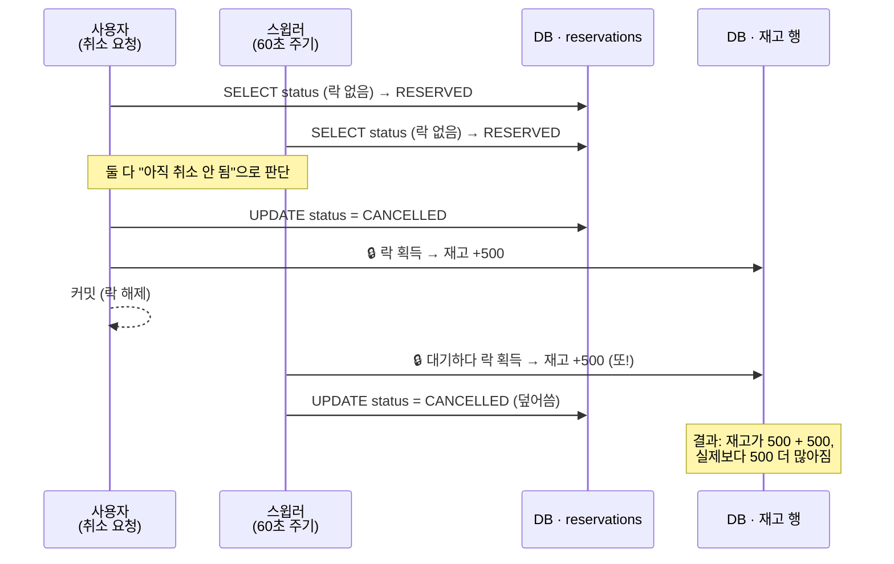

### 배경

PR #28([`ReservationService`](../src/main/java/com/fptis/intern/server/application/reservation/ReservationService.java)) 리뷰 중 발견한 문제입니다.

`ReservationService`가 건드리는 테이블 중 재고(`BranchCurrencyRate`)와 슬롯(`BranchTimeSlot`)에는
discussion#13(방안 A, 1 Row Locked)에 따라 `PESSIMISTIC_WRITE` 락이 정확히 걸려 있습니다. 그런데 그
락을 "쓸지 말지" 판단하는 기준인 예약(`Reservation`) 행 자체는 어디서도 잠그지 않고 `findById`로만
읽습니다. 그 결과, 취소(`cancelReservation`)와 자동만료 스윕(`expireOverdueReservations`)이 같은
예약을 거의 동시에 건드리면 재고·슬롯이 두 번 복원되는 레이스가 생깁니다.

> 참고: [`ReservationExpirySweeper`](../src/main/java/com/fptis/intern/server/application/reservation/ReservationExpirySweeper.java)는
> `@Scheduled(fixedDelay = 60_000)` — 60**초** 주기이며, 확인하는 값은 결제 성공 여부가 아니라
> `Reservation.expiresAt`(2시간 픽업 홀드)이 지났는지입니다. 이 PR 시점에는 결제(Stripe) 도메인이
> 아직 없어서, "결제 확인용 스윕"은 이 스윕과는 별개로 이후 결제 분리(discussion#16) 쪽에서 다룰
> 사안입니다 — 헷갈리지 않게 여기서는 "픽업 홀드 만료 스윕"으로 부르겠습니다.

전제가 되는 제약은 다음과 같습니다.

- 재고·슬롯의 락 방식은 discussion#13으로 이미 못박힌 상태라 그대로 유지합니다. 이번 논의는 그
  위에서 아직 안 잠긴 `Reservation` 행 하나를 어떻게 보호할지에 한정됩니다.
- `Reservation`은 취소(`DELETE /reservations/{id}`) · 조회(`GET /reservations/{id}`) · 픽업
  검증(`POST .../redeem`) · 자동만료(스케줄러) 총 4개 경로에서 각각 다른 트랜잭션으로 접근됩니다.
- `Reservation.cancel()`은 이미 `CANCELLED`/`COMPLETED`면 예외를 던지지만, 이 체크는 각 트랜잭션이
  자기 스냅샷에서 읽은 in-memory 상태를 보는 것이라 상대방이 커밋하기 전까지는 막지 못합니다.

---

### 문제 재현

사용자가 취소 버튼을 누르는 순간과, 스윕러가 같은 예약을 "정리 대상"으로 집는 순간이 겹치는
경우입니다.

재고 행 자체는 `PESSIMISTIC_WRITE`라 두 복원이 순서대로 처리되긴 하지만, "복원해도 되는지"를 각자
잘못 판단한 채로 순서대로 실행되는 것뿐이라 결과적으로 이중 복원을 막지 못합니다.

---

### 해결방안

#### 방안 1: 비관적 락 (`Reservation` 조회에도 `PESSIMISTIC_WRITE`)

`cancelReservation` / `redeem` / `expireOverdueReservations`에서 `findById` 대신 `SELECT ... FOR
UPDATE`로 예약 행을 잠그고 시작합니다. 잠금 조회는 스냅샷이 아니라 **현재 커밋된 값**을 읽으므로,
뒤에 도착한 트랜잭션은 락을 기다렸다가 이미 `CANCELLED`로 바뀐 최신 상태를 보게 되고, 기존
`cancel()`의 상태 체크가 그대로 `ALREADY_CANCELLED`로 막아줍니다 — 새 예외 타입 없이 기존 도메인
예외 경로를 재사용할 수 있습니다.

다만 재고 → 슬롯 순서로만 정의돼 있던 락 획득 순서에 `Reservation`이 추가되므로, 데드락을 피하려면
전 경로에서 "예약 → 재고 → 슬롯" 순서를 새로 통일해야 합니다.

#### 방안 2: 낙관적 락 (`@Version` 컬럼)

`Reservation`에 `@Version private Long version;`을 추가합니다. 평소에는 아무 비용이 없다가, 커밋
시점에 JPA가 버전이 그사이 바뀌었는지 자동으로 검사해 바뀌었으면
`ObjectOptimisticLockingFailureException`을 던집니다. 늦게 커밋하려는 쪽만 실패하므로 재고 복원은
정확히 한 번만 일어납니다.

---

### 비교

| 관점 | 방안 1: 비관적 락 | 방안 2: 낙관적 락(`@Version`) |
|---|---|---|
| 충돌 없는 정상 경로 비용 | 매 취소·redeem·만료마다 락 획득/해제 비용 상시 발생 | 버전 컬럼 비교만 추가, 사실상 무비용 |
| 충돌 시 결과 | 뒤 트랜잭션이 대기 후 최신 상태를 보고 기존 `ALREADY_CANCELLED` 예외로 자연스럽게 막힘 | 늦은 트랜잭션이 `OptimisticLockException` — 서비스 레이어에서 별도로 잡아 처리 필요 |
| 데드락 위험 | `Reservation`이 락 대상에 추가되며 재고·슬롯과의 락 순서 규칙을 새로 정의해야 함 | 락을 아예 안 걸어 데드락 리스크 없음 |
| 구현 변경 범위 | 리포지토리에 `findByIdForUpdate` 추가, 호출부 3곳 교체 | 엔티티에 컬럼 추가 + 마이그레이션, 충돌 예외 핸들링 추가 |
| 이 레이스의 발생 빈도 | 항상 안전(락 방식이라 확률과 무관) | 낮은 충돌 확률을 전제로 함 — 실제로 잦다면 재시도 로직까지 필요해짐 |

---

### 의견 수립

이 문제를 푸는 방향으로 **방안 2(낙관적 락)를 제안**합니다. 이유는 다음과 같습니다.

1. 이 레이스가 실제로 발생하려면 "취소 요청"과 "60초 스윕 주기"가 초 단위로 겹쳐야 하는데, 이건
   2시간 픽업 홀드 중 마지막 60초 안팎의 아주 좁은 창에서, 그것도 사용자가 하필 그 순간 취소를
   눌러야만 생깁니다. 이 정도로 드문 경합을 막으려고 `Reservation`의 모든 취소·redeem·조회 경로에
   상시 락 대기 비용을 지불하는 건 과하다고 봤습니다.
2. 낙관적 락은 "거의 항상 공짜, 충돌 났을 때만 비용"이라 이 케이스의 확률 분포(거의 0, 아주 가끔
   1)에 더 잘 맞습니다.
3. 재고·슬롯처럼 항상 잠가야 하는 자원(모든 예약 생성이 반드시 거치는 경로)과 달리, `Reservation`
   취소·만료는 상대적으로 드문 경로라 락 순서 규칙을 새로 늘리는 것보다 부담이 적은 쪽을
   택했습니다.

다만 이건 "충돌 확률이 낮다"는 가정에 기대고 있어서, 그 가정 자체가 맞는지 팀 의견이 필요합니다.

---

### 의견 요청

궁금한 점은 다음과 같습니다.

1. 이 레이스의 발생 확률을 "낮다"고 보는 판단이 맞는지 — 스케줄러 주기(60초)나 실제 취소 패턴을
   감안했을 때 이 정도로 안심해도 되는 수준인지 궁금합니다.
2. `OptimisticLockException`이 실제로 발생했을 때, 취소 요청 쪽 사용자에게는 어떤 응답을 주는 게
   맞을지(예: "이미 만료 처리된 예약입니다" 안내 vs 조용히 성공 처리) 의견을 듣고 싶습니다.
3. 이번 레이스는 `Reservation` 상태 전이에 국한된 문제인데, 같은 종류의 check-then-act 레이스가
   있는 노쇼 제한 체크(`assertNoShowLimitNotExceeded`)도 같은 낙관적 락으로 커버할 수 있는지, 아니면
   별도 처리가 필요한지 궁금합니다.
4. 프로덕션에서 이 충돌이 실제로 얼마나 발생하는지 관측할 방법(로그/메트릭)을 이번에 같이 넣을지,
   아니면 발생 시점에 추가할지 궁금합니다.
