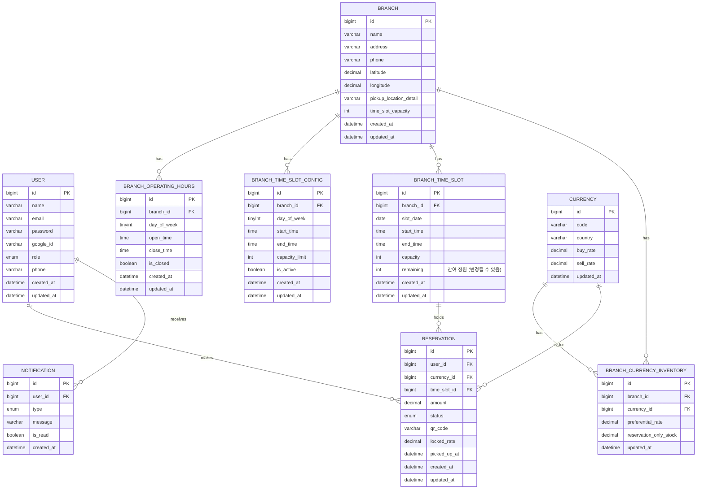

```mermaid
erDiagram
USER {
bigint id PK
varchar name
varchar email
varchar password
varchar google_id
enum role
varchar phone
datetime created_at
datetime updated_at
}

    BRANCH {
        bigint id PK
        varchar name
        varchar address
        varchar phone
        decimal latitude
        decimal longitude
        varchar pickup_location_detail
        int time_slot_capacity
        datetime created_at
        datetime updated_at
    }

    BRANCH_OPERATING_HOURS {
        bigint id PK
        bigint branch_id FK
        tinyint day_of_week
        time open_time
        time close_time
        boolean is_closed
        datetime created_at
        datetime updated_at
    }

    BRANCH_TIME_SLOT_CONFIG {
        bigint id PK
        bigint branch_id FK
        tinyint day_of_week
        time start_time
        time end_time
        int capacity_limit
        boolean is_active
        datetime created_at
        datetime updated_at
    }

    BRANCH_TIME_SLOT {
        bigint id PK
        bigint branch_id FK
        date slot_date
        time start_time
        time end_time
        int capacity
        int remaining "잔여 정원 (변경될 수 있음)"
        datetime created_at
        datetime updated_at
    }

    CURRENCY {
        bigint id PK
        varchar code
        varchar country
        decimal buy_rate
        decimal sell_rate
        datetime updated_at
    }

    BRANCH_CURRENCY_INVENTORY {
        bigint id PK
        bigint branch_id FK
        bigint currency_id FK
        decimal preferential_rate
        decimal reservation_only_stock
        datetime updated_at
    }

    RESERVATION {
        bigint id PK
        bigint user_id FK
        bigint currency_id FK
        bigint time_slot_id FK
        decimal amount
        enum status
        varchar qr_code
        decimal locked_rate
        datetime picked_up_at
        datetime created_at
        datetime updated_at
    }

    NOTIFICATION {
        bigint id PK
        bigint user_id FK
        enum type
        varchar message
        boolean is_read
        datetime created_at
    }

    BRANCH ||--o{ BRANCH_OPERATING_HOURS : "has"
    BRANCH ||--o{ BRANCH_TIME_SLOT_CONFIG : "has"
    BRANCH ||--o{ BRANCH_TIME_SLOT : "has"
    BRANCH ||--o{ BRANCH_CURRENCY_INVENTORY : "has"
    CURRENCY ||--o{ BRANCH_CURRENCY_INVENTORY : "has"
    BRANCH_TIME_SLOT ||--o{ RESERVATION : "holds"
    USER ||--o{ RESERVATION : "makes"
    CURRENCY ||--o{ RESERVATION : "is_for"
    USER ||--o{ NOTIFICATION : "receives"
```
