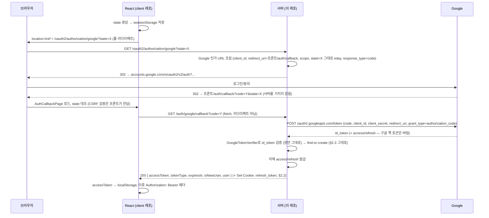
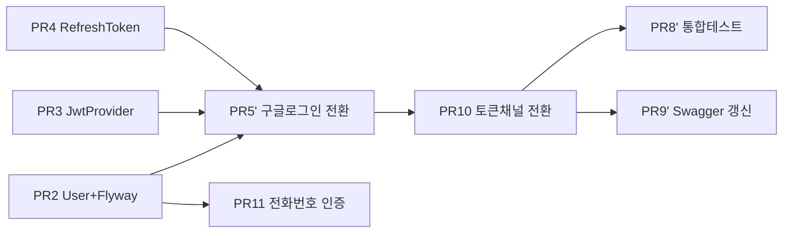

# 구글 OAuth 로그인 — 이슈/PR 계층 분해 계획

> 작성일: 2026-07-17 (최초) / **개정: 2026-07-17 — 실제 React 프론트엔드 코드(`~/IdeaProjects/client`) 확인 후 아키텍처 재정렬**
> 대상: TravelX 서버 (Spring Boot 4.1 / Java 21 / MySQL / JWT) + TravelX 클라이언트(React 19 / Vite / react-router 7)
> 목적: 구글 OAuth 로그인 기능을 **Epic → 하위 이슈 → 이슈당 PR 1개**로 쪼개어, 작은 단위로 리뷰·머지하며 진행한다.

---

## ⚠️ 이 개정판을 읽기 전에

최초 계획(§2.1 원안)은 **"React가 GIS로 ID 토큰을 받아 `POST /auth/google`로 던진다"**는 가정 위에 백엔드를 먼저 설계하고 구현까지 마친 상태였다. 그런데 실제 `~/IdeaProjects/client` 코드를 열어보니 프론트엔드는 이미 **완전히 다른 흐름 — authorization-code 리다이렉트 방식**으로 짜여 있었다(`LoginPage.tsx`, `utils/oauth.ts`, `AuthCallbackPage.tsx`, `api/auth.ts`, `hooks/useAuth.ts`, `types/index.ts` 확인).

**원칙: 프론트엔드는 이미 완성된 앱이고, 백엔드 인증 모듈은 아직 자유롭게 바꿀 수 있는 쪽이다. 따라서 프론트 코드를 정답으로 두고 백엔드를 그에 맞춘다.** 이 문서는 무엇이 그대로 살아남고(§2.4 표), 무엇이 뒤집히는지(⚠️ 표시)를 숨기지 않고 전부 드러낸다.

## 1. 배경

- 클라이언트는 **React 19 + Vite + react-router-dom 7** SPA, 저장소는 `~/IdeaProjects/client` (본 서버 레포와 별도).
- 서버는 API 전용. `global`(config/exception/base) + 인증 도메인(`domain/user`, `domain/auth`)까지 이미 구현되어 있다 (Spring Security 미사용, tugo-server 패턴 계승 — 이 부분은 §2.4에서 대부분 생존).
- **프론트 코드에서 실제로 확인한 계약:**
  - `LoginPage.tsx`: CSRF `state`를 만들어 `sessionStorage`에 저장하고, `window.location.href = "${API_BASE_URL}/oauth2/authorization/google?state=..."`로 **풀 페이지 리다이렉트**.
  - `AuthCallbackPage.tsx`(라우트 `/auth/callback`): 자기 자신의 URL 쿼리에서 `code`·`state`를 직접 읽는다 → 구글이 **프론트엔드의 `/auth/callback`으로 직접 리다이렉트**한다는 뜻. `state`를 세션스토리지 값과 대조(CSRF 방어)한 뒤 `exchangeGoogleCode(code)` 호출.
  - `api/auth.ts`: `exchangeGoogleCode` = `GET /auth/google/callback?code=...` (POST 아님, body 아님, 쿼리 파라미터).
  - `types/index.ts`: 응답 타입 `GoogleLoginResponse = { accessToken, tokenType, expiresIn, isNewUser, user: { id, name, email, phone, phoneVerified, role } }`.
  - `hooks/useAuth.ts`: `session.accessToken`을 **`localStorage`**에 저장하고, `utils/http.ts`는 매 요청에 `Authorization: Bearer <token>` 헤더를 붙인다. `fetch`에 `credentials: 'include'`는 **없다** — 즉 쿠키는 자동으로 전송되지 않는다.
  - `api/auth.ts`에 `requestPhoneCode`/`confirmPhoneCode`(`POST /auth/verify-phone`, `mode: REQUEST|CONFIRM`)가 이미 정의돼 있고, `RegisterPage.tsx`(신규 가입자용 KYC 단계)에서 쓰인다 — **백엔드에 아직 없는 기능**.
  - `useAdminAuth.ts`/`AdminLoginPage.tsx`는 `localStorage` 플래그만 쓰는 완전 목업이고 어떤 백엔드 API도 호출하지 않는다 — **이번 계획 범위 밖**으로 명시적으로 제외한다.

## 2. 아키텍처 결정

### 2.1 OAuth 통합 패턴 — **authorization-code 리다이렉트, 프론트가 콜백을 소유** (개정, 채택)

> **⚠️ [업데이트 2026-07-17] §2.1 원안("ID 토큰 POST + 자체 JWT")을 철회하고 아래로 대체한다.** 원안은 프론트 코드 없이 세운 가정이었다 — 실제 프론트는 리다이렉트 방식을 이미 구현해뒀다. 다행히 원안에서 만든 `GoogleTokenVerifier` 추상화(ID 토큰 서명 검증)와 find-or-create 로직은 그대로 재사용 가능하다 — code-exchange로 받은 `id_token`을 그 검증기에 그대로 흘려보내면 된다. **버려지는 코드는 `POST /auth/google` 엔드포인트와 그 요청 DTO뿐, 검증·연동 로직 본체는 생존한다.**

흐름 (프론트 코드 기준으로 역산):



핵심 설계 포인트:

- **`state`는 프론트가 생성·소유·검증한다.** 서버는 그냥 통과시키는 relay다 — 서버 세션이 전혀 필요 없고, Spring Security의 세션 기반 OAuth2 Client 흐름과 근본적으로 다르다. Security 없이 직접 구현한다는 §2.4 원칙과 잘 맞는다.
- **Google 콘솔 등록값이 두 종류로 나뉜다는 점을 헷갈리면 안 된다:**
  - *Authorized JavaScript origins* — GIS 위젯용(원안에서 쓰려던 것, 지금은 안 씀).
  - **Authorized redirect URIs** — 이번에 실제로 써야 하는 필드. 값은 **프론트엔드의 `/auth/callback` 풀 URL**(예: 로컬 `http://localhost:5173/auth/callback`, 운영은 실제 프론트 도메인) — **서버 URL이 아니다.** code 교환 시 이 값과 정확히 일치하는 `redirect_uri`를 다시 보내야 구글이 code를 발급해준다(exact match).
- **`GOOGLE_CLIENT_SECRET`이 새로 필요하다.** 원안(ID 토큰 검증만)은 공개 클라이언트로 충분했지만, code-exchange는 confidential client 동작이라 secret이 필수다. `.env.example`/`k8s/overlays/*/secret.env`에 추가해야 한다(값은 시크릿이므로 configmap이 아니라 secret에).
- 구현 라이브러리: 이미 있는 `com.google.api-client:google-api-client:2.7.0`에 `GoogleAuthorizationCodeTokenRequest`가 포함돼 있어 신규 의존성 추가 없이 code-exchange를 구현할 수 있다.

### 2.2 토큰 전달 채널 — **⚠️ 팀 승인 필요 — 프론트에 맞추면 보안 트레이드오프가 뒤집힌다**

원안 §2.2는 "access/refresh 모두 httpOnly 쿠키로만 전달, React는 토큰을 절대 만지지 않는다 → XSS로 탈취 불가"를 핵심 방어선으로 제시했고, §2.4에서 **Bearer 헤더 지원을 의도적으로 뺐다.** 그런데 프론트는:

- `session.accessToken`을 **`localStorage`에 저장**하고
- 모든 요청에 **`Authorization: Bearer` 헤더**로 보낸다(`utils/http.ts`).

이건 원안이 피하려던 정확히 그 패턴이다 — **access token이 XSS에 노출된다.** 이미 만들어진 SPA를 다시 쿠키 전용으로 뜯어고치는 비용 vs 보안 저하를 감수하는 비용을 팀이 저울질해야 한다. 제안하는 절충안(추천, 최종 결정 아님):

| 토큰 | 채널 | 근거 |
|------|------|------|
| **Access** | 응답 바디(JSON) → 프론트가 `localStorage`에 저장 → `Authorization: Bearer` 헤더 | 프론트 코드를 그대로 살린다. 대신 **수명을 원안보다 더 짧게**(15분 권장, 30분 상한) 가져가 XSS 탈취 시 피해 시간을 줄인다 |
| **Refresh** | **httpOnly 쿠키 유지** (body에 노출 안 함) | 수명이 긴(14일) 시크릿만큼은 JS가 못 만지게 남겨둔다 — 절충안의 핵심. 단, §2.6에서 보듯 **프론트가 이 쿠키를 쓸 코드가 아직 없다** |

이렇게 하면 `UserIdFilter`가 **Bearer 헤더 우선, 쿠키는 폴백**(또는 access 쿠키는 완전히 제거) 방식으로 바뀌어야 한다 — §2.4 표의 "🔁 변경: Bearer fallback 없음" 항목이 정확히 뒤집힌다.

> **멘토/팀에 그대로 물어야 할 질문**: "SPA가 access token을 localStorage에 두는 걸 감수할 것인가, 아니면 프론트를 고쳐서 쿠키 전용으로 되돌릴 것인가?" — 이건 코드 문제가 아니라 정책 결정이다. §6에 추가.

### 2.3 계정 연동(account linking) — **원안 그대로 생존**

`google_id` 조회 → 없으면 `email` 조회 + `email_verified=true`일 때만 연동 → 없으면 신규 생성. code-exchange로 받은 `id_token`도 여전히 `email_verified` 클레임을 포함하므로 이 로직은 손댈 필요가 없다. (원안 §2.3, 팀 승인 필요 상태도 유지)

### 2.4 tugo-server 계승 컴포넌트 — 생존/변경 갱신판

| 구성 요소 | 상태 | 비고 |
|-----------|------|------|
| `UserIdFilter`(`OncePerRequestFilter`) | 🔁 **변경 필요** | 쿠키 파싱만 하던 걸 **`Authorization: Bearer` 헤더 파싱을 우선**으로 추가해야 한다(§2.2). refresh 쿠키 파싱(`CookieUtil.getRefreshTokenFromRequest`)은 `/auth/reissue`·`/auth/logout` 한정으로 계속 쓴다 |
| `AuthInterceptor` | ✅ 생존 | `@RequireAuth` 옵트인 방식 그대로. request attribute 소스만 바뀔 뿐 인터페이스는 동일 |
| `UserIdArgumentResolver` | ✅ 생존 | 그대로 |
| `GlobalExceptionHandler` | ✅ 생존 | 그대로 |
| `GoogleTokenVerifier`/`GoogleIdTokenVerifierAdapter` | ✅ 생존(입력만 바뀜) | 원안엔 프론트가 직접 준 id_token을 검증했다면, 이제는 서버가 code-exchange로 **받아온** id_token을 검증한다 — 검증기 내부 로직은 무변경 |
| `GoogleAuthService`(find-or-create) | ✅ 생존 | `isNewUser` 반환값만 추가(§2.5) |
| `RefreshTokenService`(발급/회전/폐기) | ✅ 생존 | 그대로 |
| `POST /auth/google` (엔드포인트 자체) | ❌ **폐기** | `GET /oauth2/authorization/google` + `GET /auth/google/callback`으로 교체(§2.1) |
| `CookieUtil.addAccessTokenCookie` | ❌ **삭제 대상** | access token은 이제 body로만 나간다. refresh 쿠키 관련 메서드는 유지 |

### 2.5 응답 DTO 계약 (신규 — 프론트 `types/index.ts` 기준, 협상 불가)

```ts
// GET /auth/google/callback?code=... 의 응답, 그리고 프론트가 실제로 파싱하는 형태
interface GoogleLoginResponse {
  accessToken: string
  tokenType: string      // "Bearer" 고정
  expiresIn: number       // 초 단위 — JwtProvider의 만료시간을 ms→s 변환해서 채워야 함
  isNewUser: boolean       // find-or-create에서 "생성"과 "조회"를 구분해 반환해야 함 (현재 LoginResult엔 없음)
  user: {
    id: number
    name: string
    email: string
    phone: string | null
    phoneVerified: boolean // User 엔티티에 없는 컬럼 — §2.7에서 추가
    role: string
  }
}
```

이 DTO는 프론트가 이미 소비하고 있는 계약이므로 필드명·타입을 임의로 바꾸면 프론트가 깨진다.

### 2.6 클라이언트(React) 쪽 갭 — 이 레포 범위 밖, 참고용으로만 기록

이번 계획은 **서버 레포 작업**이 범위지만, 서버를 프론트에 맞추는 과정에서 프론트 쪽에도 아직 없는 조각이 보였다 — 나중에 `client` 레포 작업자가 놓치지 않도록 기록만 해둔다(이 문서에서 구현하지 않음):

- `utils/http.ts`의 `fetch`에 `credentials: 'include'`가 없다 → refresh 쿠키를 §2.2 절충안대로 유지하면, `/auth/reissue`·`/auth/logout` 호출 시 쿠키가 아예 전송되지 않는다. 프론트가 이 옵션을 추가해야 절충안이 실제로 동작한다.
- `api/auth.ts`에 **`/auth/reissue`를 호출하는 코드가 아예 없다.** access token 만료 시 401을 그냥 던지고 끝 — 자동 재발급 인터셉터가 없다. MVP에서는 "401이면 로그아웃 처리 후 재로그인 유도"로 갈지, 인터셉터를 추가할지 프론트 팀 결정 필요.
- 관리자(Admin) 인증은 완전 목업 — 이번 계획·이번 문서 범위에 포함하지 않는다.

### 2.7 신규 범위 — 전화번호 인증(KYC), 프론트가 이미 기대 중

`RegisterPage.tsx`(신규 가입 시 `isNewUser=true`면 진입)가 `POST /auth/verify-phone`을 이미 호출하고 있다 — 원안에는 없던 완전히 새로운 기능이다.

- 엔드포인트: `POST /auth/verify-phone`, body `{ phone, mode: "REQUEST" | "CONFIRM", code? }`, 응답 `{ verified: boolean, expiresAt: string | null }`.
- `REQUEST`: SMS(또는 그 대체 수단)로 인증코드 발송 — **SMS 프로바이더 미정, §6 멘토 질문에 추가.**
- `CONFIRM`: 코드 대조 → `verified=true`면 `User.phoneVerified=true`, `User.phone` 갱신.
- `User` 엔티티에 `phoneVerified`(boolean, default false) 컬럼 추가 → Flyway `V3__add_phone_verified_to_users.sql`.
- 인증코드 저장은 Redis 없이 MySQL 임시 테이블(만료시간 포함) 또는 짧은 TTL의 별도 테이블로 — RefreshToken과 같은 패턴(해시 저장까진 불필요, 코드 자체가 단기·1회성이므로).

### 2.8 `dev-tools/google-login-test.html` 폐기 필요

지난 세션에 만든 이 파일은 **GIS 팝업 + ID 토큰 POST** 흐름(원안 §2.1)을 테스트하기 위한 도구였다 — 이번 개정으로 그 흐름 자체가 폐기됐으므로 **이 파일은 이제 실제 프론트가 쓰지 않는 흐름을 테스트하는 오해의 소지가 있는 도구**가 됐다. PR 작업 시 삭제하거나, `GET /oauth2/authorization/google` 리다이렉트 흐름을 흉내 내는 형태로 다시 만들어야 한다(간단한 방법: 그냥 `http://localhost:8080/oauth2/authorization/google?state=test`를 브라우저 주소창에 직접 치는 걸로 충분해서, 별도 HTML 도구 자체가 불필요해질 수도 있다).

## 3. 이슈 계층 (개정)

기존 #1~#4(인프라/User/JwtProvider/RefreshToken)는 코드로 이미 존재하고 그대로 생존한다(§2.4). 아래는 이번 개정으로 **바뀌거나 새로 추가되는 이슈**만 나열한다.

```
[Epic] 구글 OAuth 로그인 + JWT 인증 체계 구축 (개정판)
 ├─ #1~#4 (생존, 변경 없음) 인증 인프라 / User / JwtProvider / RefreshToken 영속화
 ├─ #5' 구글 로그인 아키텍처 전환 — ID 토큰 POST → 리다이렉트+code exchange
 │     (GET /oauth2/authorization/google, GET /auth/google/callback, GoogleAuthorizationCodeExchanger)
 ├─ #10 신규 — 토큰 전달 채널 전환 (UserIdFilter Bearer 우선, CookieUtil access 쿠키 제거)
 ├─ #11 신규 — 전화번호 인증(KYC) — POST /auth/verify-phone, phoneVerified 컬럼(V3)
 ├─ #6 (생존) POST /auth/reissue — refresh는 계속 쿠키 기반
 ├─ #7 (생존) 로그아웃 · 회원탈퇴
 ├─ #8 (수정) 통합 테스트 — 시나리오를 리다이렉트+콜백 기준으로 재작성
 └─ #9 (수정) Swagger 문서화 — bearer scheme만 남기고 쿠키 기반 access 스킴 제거
```

## 4. PR 분해표 (변경분만)

| PR | 제목 | 범위 In | 범위 Out | 수락 기준 | 크기 | 의존 |
|----|------|---------|----------|-----------|------|------|
| **5'** | 구글 로그인 아키텍처 전환 | `GET /oauth2/authorization/google?state=`(인가 URL 조립+302), `GoogleAuthorizationCodeExchanger`(`GoogleAuthorizationCodeTokenRequest`로 code→id_token), 기존 `GoogleTokenVerifier`에 흘려보내기, `GET /auth/google/callback?code=` 신설, 기존 `POST /auth/google` 삭제, `GOOGLE_CLIENT_SECRET`/redirect_uri 설정 추가 | 토큰 전달 채널(§10) | 가짜 code-exchanger로 콜백 호출 → §2.5 DTO 그대로 반환, exact-match 안 되는 redirect_uri는 실패 처리 확인 | M | PR2·3·4 |
| **10** | 토큰 전달 채널 전환 | `UserIdFilter`가 `Authorization: Bearer` 우선 파싱, `CookieUtil`에서 access 쿠키 관련 메서드 제거(refresh는 유지), `AuthController`가 accessToken을 응답 바디로 반환 | 리프레시 로직 자체 | Bearer 헤더로 `@RequireAuth` 엔드포인트 통과, 쿠키만 있고 헤더 없으면 401(access 쿠키는 더 이상 유효 채널 아님) | S | PR5' |
| **11** | 전화번호 인증(KYC) | `POST /auth/verify-phone`(REQUEST/CONFIRM), `User.phoneVerified` + Flyway V3, 인증코드 임시 저장 테이블 | 실제 SMS 발송 연동(프로바이더 미정 — §6) | REQUEST 후 CONFIRM 정상 케이스/오답 케이스 단위테스트, 프로바이더는 인터페이스 뒤에 목업으로 시작 | M | PR2 |
| **8'** | 통합 테스트 재작성 | 콜백 code→토큰 발급→Bearer로 보호 API 호출→reissue→logout E2E | — | 시나리오 그린 | M | PR5'·PR10 |
| **9'** | Swagger 문서화 갱신 | bearer scheme만 등록(쿠키 스킴 제거), `/oauth2/authorization/google`은 브라우저 리다이렉트용이라 Swagger에서 "Try it out" 불가함을 설명 주석으로 명시 | — | Swagger Authorize(Bearer)로 보호 API 호출 성공 | S | PR10 |

### 의존성 그래프



- PR11(전화번호 인증)은 PR5'/PR10과 파일이 거의 안 겹치므로 병렬 가능.

## 5. Pitfalls 체크리스트 (이번 개정으로 추가된 항목만)

- [ ] **Google 콘솔의 두 필드를 혼동하지 말 것.** "Authorized JavaScript origins"(GIS 위젯용, 원안에서나 씀)와 **"Authorized redirect URIs"**(이번에 실제로 써야 함, 값=프론트 `/auth/callback`)는 다른 설정란이다. 지난 세션에 `dev-tools` 테스트하며 등록한 origin은 이번 흐름과 무관하다.
- [ ] **redirect_uri exact-match.** 인가 요청(`/oauth2/authorization/google`이 구글로 보내는 최초 요청)과 code-exchange(`/auth/google/callback`이 구글 토큰 엔드포인트로 보내는 두 번째 요청) 양쪽에 **완전히 동일한 문자열**의 `redirect_uri`를 보내야 한다. 로컬(`localhost:5173`)과 운영 도메인이 다르므로 환경변수화 필수.
- [ ] **`state`는 서버가 생성하지 않는다.** 프론트가 만든 값을 그대로 구글에 relay만 한다 — 서버가 자체 state를 새로 만들면 프론트의 CSRF 검증이 항상 실패한다.
- [ ] **`GOOGLE_CLIENT_SECRET`은 `configmap.env`가 아니라 `secret.env`/K8s Secret에.** 지금 `configmap.env`엔 `GOOGLE_CLIENT_ID` 플레이스홀더만 있다 — client_secret을 실수로 configmap에 넣지 않도록 PR5' 리뷰 시 확인.
- [ ] **`isNewUser` 계산 위치.** find-or-create 로직에서 "새로 `save()`했다"와 "기존 row를 찾았다"를 구분해 `boolean`으로 끌어올려야 한다 — 현재 `GoogleAuthService`/`LoginResult`엔 이 정보가 없다.
- [ ] **access 쿠키를 완전히 끊을지, 당분간 병행할지** PR10에서 결정. 병행하면 `UserIdFilter`가 "Bearer 우선, 없으면 쿠키" 순서로 두 채널을 다 봐야 하고 테스트 케이스가 늘어난다 — 프론트가 쿠키를 더는 안 쓰는 게 확실하면 아예 access 쿠키 코드를 지우는 쪽이 단순하다.
- [ ] **`dev-tools/google-login-test.html`은 이번 개정 흐름과 맞지 않는다** — PR5' 머지 시 같이 삭제하거나 새 흐름에 맞게 다시 만들 것(§2.8).

> 원안 §5의 나머지 항목(jjwt 0.12 API, `UserIdFilter`는 예외를 던지지 않는다, CORS+쿠키, google_id/email unique, find-or-create 경합, 테스트 더블, Flyway 소유권, 시크릿 커밋 금지, PasswordEncoder YAGNI, springdoc 버전 이슈)은 이번 개정과 무관하게 전부 유효하다 — 재확인만 하고 유지.

## 6. 멘토/팀 확인 요청 (개정)

1. **[신규, 최우선]** §2.2 access token을 `localStorage`+Bearer로 두는 걸 그대로 받아들일지, 프론트를 고쳐서 쿠키 전용으로 되돌릴지 — 이미 만들어진 SPA를 얼마나 존중할지의 문제라 정책 결정이 필요하다.
2. **[신규]** §2.7 전화번호 인증의 SMS 프로바이더(예: 알리고, Twilio, NHN Cloud 등) — 4주 MVP 일정상 실제 SMS 없이 "콘솔에 코드 출력" 목업으로 시작해도 되는지.
3. (원안 유지) §2.3 계정 자동 연동(`email_verified` 게이트) 정책 승인 여부.
4. (원안 유지, 재검토) access 토큰 수명 — §2.2 절충안대로 localStorage 노출을 감수한다면 원안의 30분보다 더 짧게(15분 이하) 가는 게 맞는지.
5. (원안 유지) refresh 재사용 감지(전 세션 폐기)를 MVP에 넣을지 stretch로 미룰지.
6. (원안 유지, 사실상 해소) React 프론트와 API 서버의 배포 도메인 관계 — `state`가 top-level 리다이렉트로만 왕복하므로 SameSite 이슈는 원안 우려보다 완화됐다. 다만 §2.6의 refresh 쿠키(교차 도메인일 경우 `SameSite=None`+CORS `credentials` 필요)는 여전히 배포 토폴로지 확정 후 재검토.
